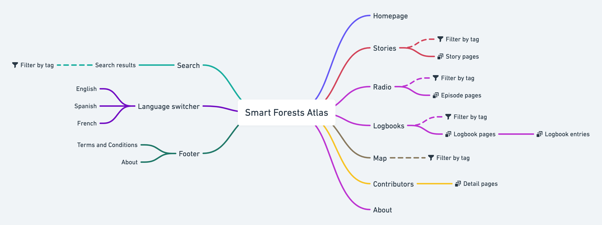

# Site Overview

## About

The atlas is a tool to capture and narrate smart forests data, including fieldwork, interviews, social network analysis, maps and environmental data from instrumented forests.

## Site overview

