# How to use the CMS

## Contents

1. [Log into the site](#log-into-the-site)
2. [Add Entries](#add-entries)
3. [Add SoundCloud embeds to Entries](#add-soundcloud-embeds-to-entries)
4. [Add Entries to a Logbook](#add-entries-to-a-logbook)
5. [Add SoundCloud embeds to Logbooks](#add-soundcloud-embeds-to-logbooks)
6. [Add a Story](#add-a-story)
7. [Add images to Stories and Logbook Entries](#add-images-to-stories-and-logbook-entries)
8. [How to use the Radio Player](#how-to-use-the-radio-player)
9. [Add a Radio Episode](#add-a-radio-episode)
10. [Creating a Tag](#creating-a-tag)
11. [Using Filters](#using-filters)
12. [Index pages](#index-pages)
13. [Add a Contributor](#add-a-contributor)
14. [Workflows](#workflows)
15. [Scheduled Publishing](#scheduled-publishing)
16. [Editing 'Information type' pages](#editing-information-type-pages)
17. [Editing the footer](#editing-the-footer)
18. [Wagtail admin](#wagtail-admin)

---

## Log into the site

<a href="https://www.loom.com/share/58b4fc5335fa40d7b61244489f2a3be6">
    
Signing into Smart Forests Atlas - Watch Video

    
  </a>

1. You will need your username and password.
2. Head to [https://atlas.smartforests.net/admin](https://atlas.smartforests.net/admin)
3. Login with the user name and password.

If you've forgotten your password, you can reset it at [https://atlas.smartforests.net/admin/password_reset/](https://atlas.smartforests.net/admin/password_reset/)

---

## Add Entries

Entries are research observations, ideas and snippets.

The more the better! The site will be richer and more interesting the more these are added.

Logbooks are composed of individual entries.

<a href="https://www.loom.com/share/10f427da614d4aaca3d62610042b6e8e">
    
Adding Entries - Watch Video

    
  </a>

1. Login to the Smart Forests Atlas.
2. Head to [https://atlas.smartforests.net/admin/pages/214/](https://atlas.smartforests.net/admin/pages/214/)
3. Click on Add Child Page.
4. Give your entry a title.
5. You can add tags - as many as you wish.
6. You can add Geographic Data, both a pin on a map and a rough estimate of location.
7. You can add the body of the entry, adding text, quotations, images and embeds as you need.
8. When done you can either save the draft, or click Publish to push this to the live site.
9. Once published you are done!

---

## Add SoundCloud embeds to Entries

<a href="https://www.loom.com/share/280d3196b37c4656994e48c7b0e0c410">
    
Adding SoundCloud to logbooks - Watch Video

    
  </a>

1. Locate a SoundCloud page you want to embed, for example [https://soundcloud.com/crickets-tinnitussleepsolution](https://soundcloud.com/crickets-tinnitussleepsolution)
2. Find a Logbook Entry you want to embed SoundCloud into.
3. Add an Embed to the body.
4. Paste in SoundCloud entry to the large text field.
5. Publish page.
6. The SoundCloud widget should now be embedded onto the page.

---

## Add Entries to a Logbook

<a href="https://www.loom.com/share/5ecfb4df860c40c9b3b23ab005735368">
    
Adding Entries To Logbooks - Watch Video

    
  </a>

Logbooks are collations of entries, bound together by their tag.

1. Login to the Smart Forests Atlas.
2. Head to [https://atlas.smartforests.net/admin/pages/213/](https://atlas.smartforests.net/admin/pages/213/)
3. Click on Add Child Page.
4. Give your logbook a title.
5. Select what tags you want to be shown within the log book.
6. You can add Geographic Data, both a pin on a map and a rough estimate of location.
7. Add Description to talk through the data as you need to, drawing attention to the important issue.
8. When done you can either save the draft, or click Publish to push this to the live site.
9. Once published you are done!

---

## Add SoundCloud embeds to Logbooks

To add a soundcloud to a logbook itself

1. Locate a SoundCloud page you want to embed, for example [https://soundcloud.com/crickets-tinnitussleepsolution](https://soundcloud.com/crickets-tinnitussleepsolution)
2. Find the Logbook you want to embed into.
3. Click on Embed icon on description.

   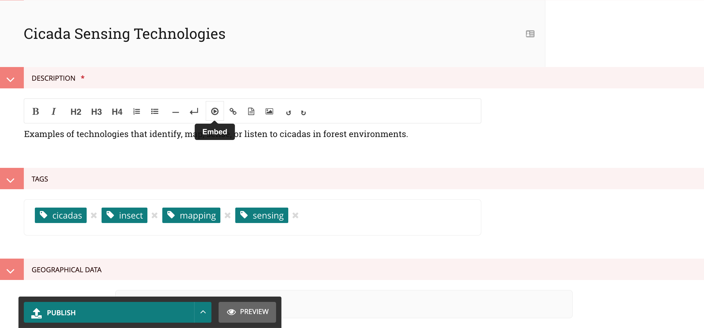

4. Paste in SoundCloud URL.

   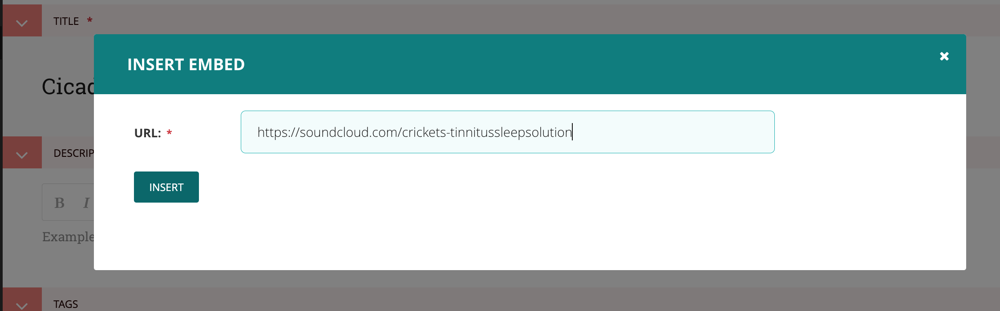

5. Click Insert button.
6. Publish page.
7. The SoundCloud widget should now be embedded onto the page.

   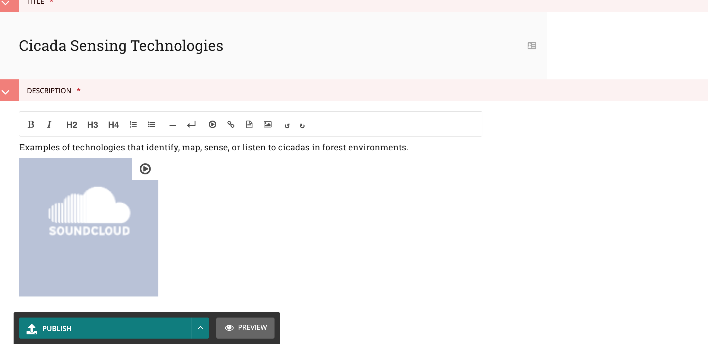

---

## Add a Story

Stories are like articles focusing on a particular topic.

1. Head to [https://atlas.smartforests.net/admin/pages/231/](https://atlas.smartforests.net/admin/pages/231/)
2. Click on Add Child Page.
3. Give your story a title.
4. Select what tags you want to be shown within the story
5. You can add Geographic Data, both a pin on a map and a rough estimate of location.
6. Add the body text of the story including any media content or images you would like
7. When done you can either save the draft, or click Publish to push this to the live site.
8. Once published you are done!

<a href="https://www.loom.com/share/54dc9a33b0194461a9d62c7eb0c1ee5e">
    
Add a story - Watch Video

    
  </a>

---

## Add images to Stories and Logbook Entries

<a href="https://www.loom.com/share/fb81b9fc875e4844be527255806b5916">
    
Adding images - Watch Video

    
  </a>

1. To add a thubmnail image to a logbook entry or story hit edit.
2. Scroll to the body section and click the plus to add content.
3. Select or upload an image.
4. Add a caption.
5. When done you can either save the draft, or click Publish to push this to the live site.
6. Once published you are done!

To add a cover image to a story scroll down to the image section at the bottom of the page

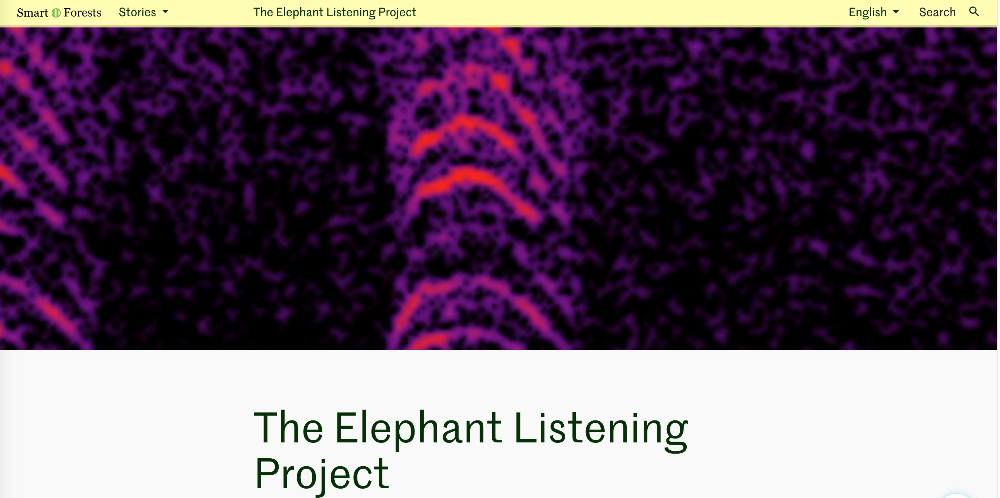

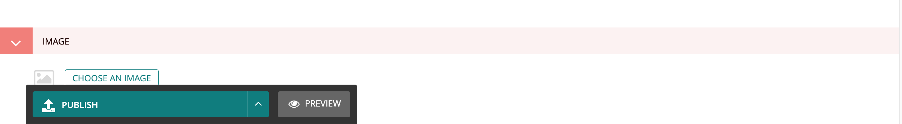

Thumbnails for logbook entries are shown as a collection on the logbook listing

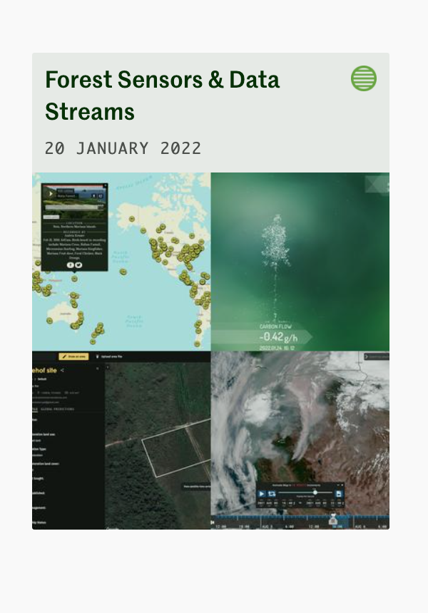

---

## How to use the Radio Player

1. Head to the Radio page [https://atlas.smartforests.net/en/radio/](https://atlas.smartforests.net/en/radio/)
2. Select the episode you would like to play
3. When you navigate away from the page the episode should still play in the footer
   <a href="https://www.loom.com/share/a9b48058d38e462b80d49c7848bafc14">
   
Radio player - Watch Video

   
   </a>

---

## Add a Radio Episode

<a href="https://www.loom.com/share/d4debb3da3744021b29d153a703adbee">
    
Add a radio episode - Watch Video

    
  </a>

1. Head to https://atlas.smartforests.net/admin/pages/234/
2. Click Add Child Page
3. Give the episode a title.
4. Select or upload the audio file for the episode.
5. Select what tags you want to be shown within the episode.
6. You can add Geographic Data, both a pin on a map and a rough estimate of location.
7. Add the body text of the story including any media content or images you would like
8. When done you can either save the draft, or click Publish to push this to the live site.
9. Once published you are done!

---

## Creating a Tag

To create a tag at the same time as adding it you can type it into the Tags box and click elsewhere on the screen.

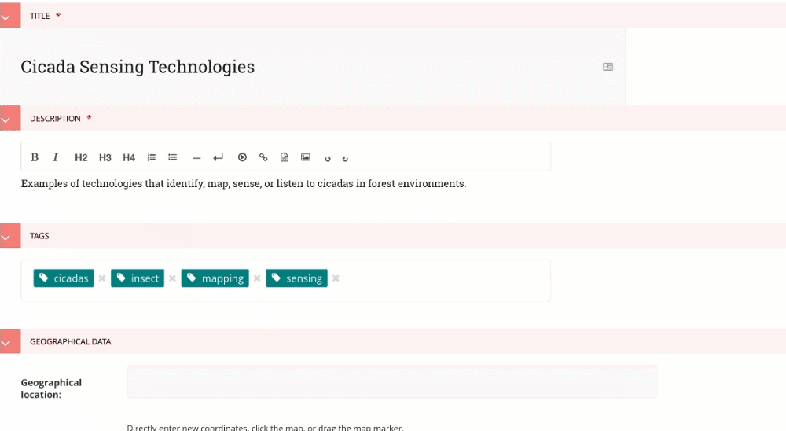

You can also go to
[https://atlas.smartforests.net/admin/snippets/smartforests/tag/](https://atlas.smartforests.net/admin/snippets/smartforests/tag/)

and select Add Tag

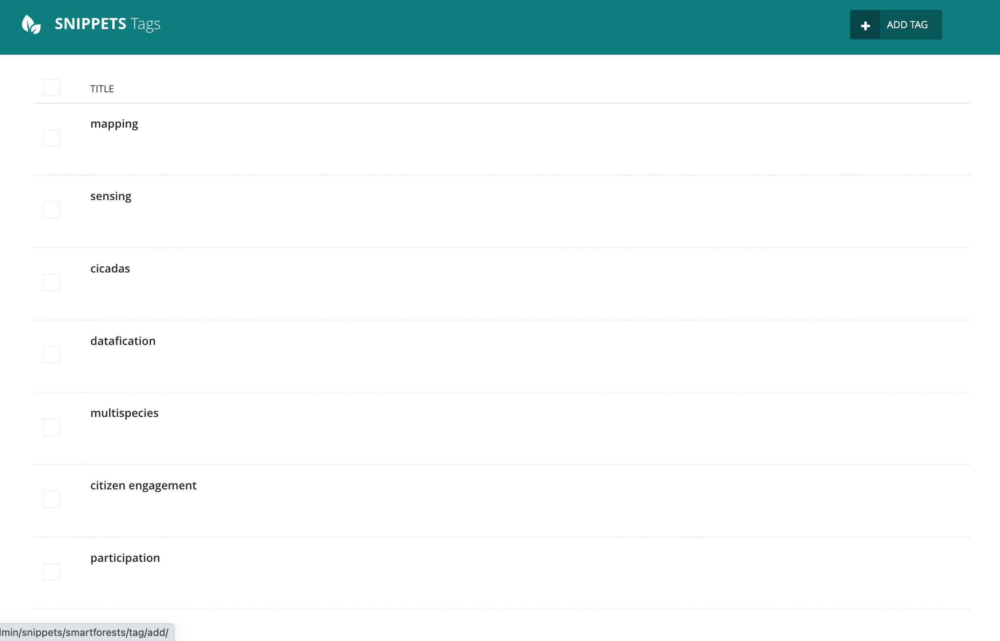

---

## Using Filters

Filters allow you to see content with a particular tag or tags

From the homepage:

Logbooks, Stories, Radio and Contributors view:

Map page:

---

## Index pages

Each content type - logbooks, radio episodes, contributors, stories has an index page

Click on the green arrow to the right of the screen to access the entries under that content type.

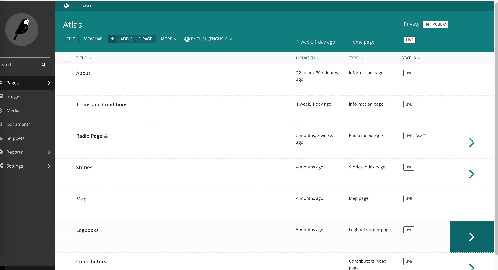

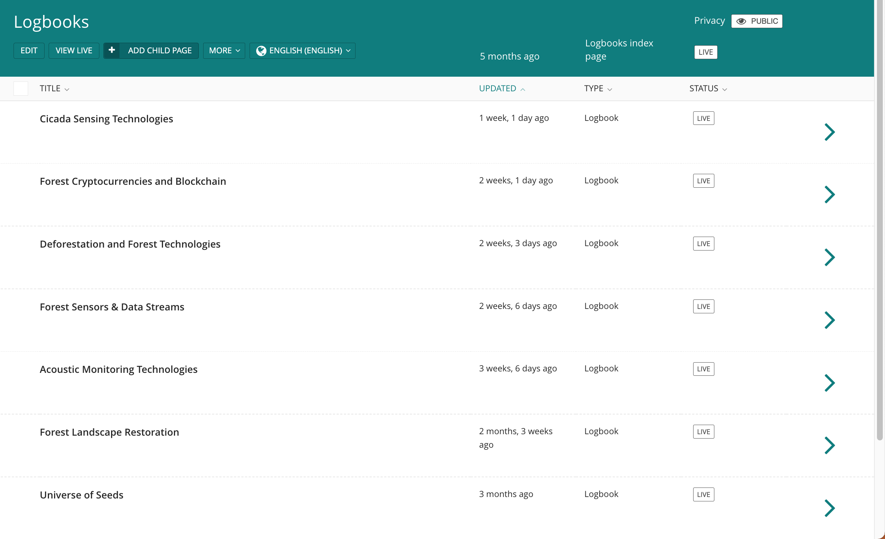

They can also be accessed from the admin panel on the left of the screen

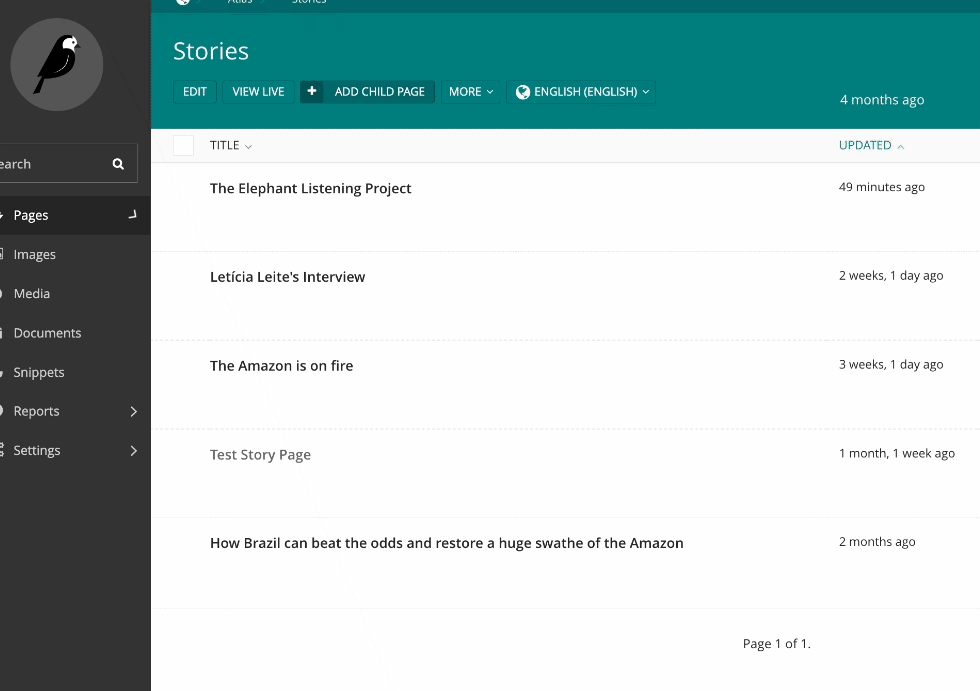

---

## Add a Contributor

<a href="https://www.loom.com/share/7b86f399ef564eda8739ba0cd9b7b586">
    
Add a contributor - Watch Video

    
  </a>

1. Head to https://atlas.smartforests.net/admin/pages/236/
2. Click Add Child Page
3. Give the page a title
4. Add the byline that you want for the contributor e.g. Researcher
5. Select or upload an image as an avatar
6. Add a geographic location for the contributor if you wish
7. Add any text, media content or images you would like in the Body field
8. When done you can either save the draft, or click Publish to push this to the live site.
9. Once published you are done!

---

## Workflows

Workflows in Wagtail allow you to moderate content on your site. You can set up a series of tasks that once complete will publish the page.

A moderator approval workflow is already set up on the site.

https://docs.wagtail.org/en/stable/editor_manual/administrator_tasks/managing_workflows.html

---

## Scheduled Publishing

Page publishing can be scheduled through the Go live date/time feature in the Settings tab of the Edit page.

https://docs.wagtail.org/en/stable/reference/pages/theory.html#scheduled-publishing

---

## Editing 'Information type' pages

1. Hover over the page and click edit

2. Edit the required fields and select publish

   

   ***

## Editing the footer

1. Head to
   https://atlas.smartforests.net/admin/wagtailmenus/flatmenu/
2. Hover over footer links and click edit

   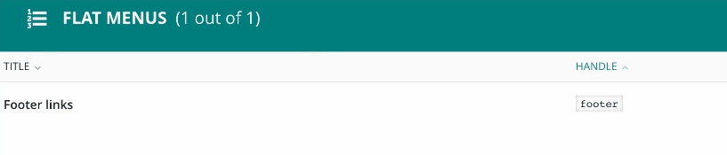

3. Add a link to an internal page e.g. About, Terms & Conditions or an external URL.

   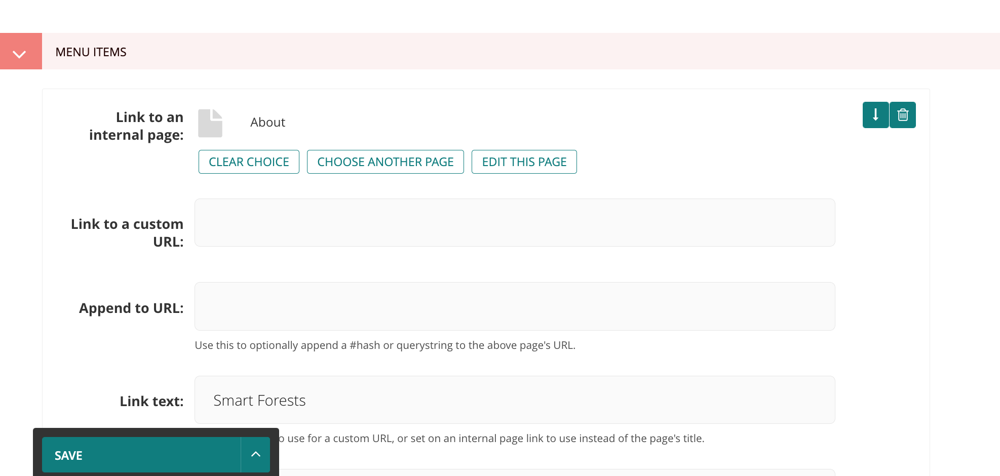

4. Add the Link text you would like displayed.
5. Hit save and you're done!

---

## Wagtail admin

The Wagtail admin menu can be accessed from every page by clicking on the Wagtail icon

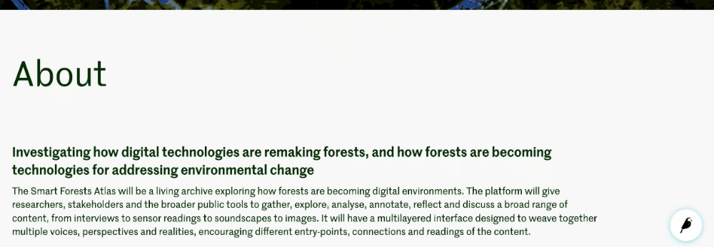
