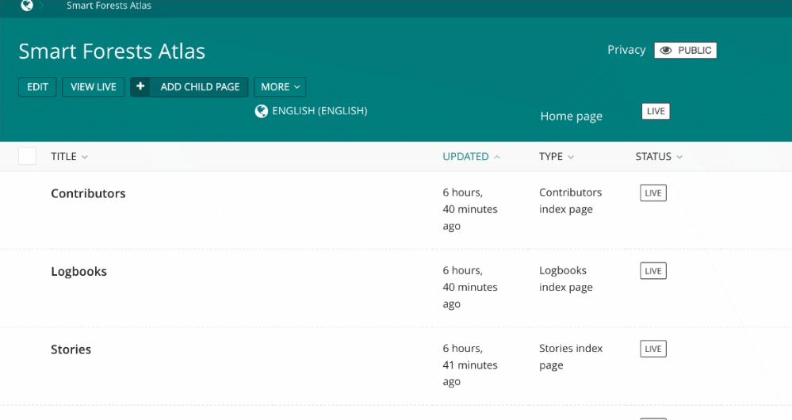
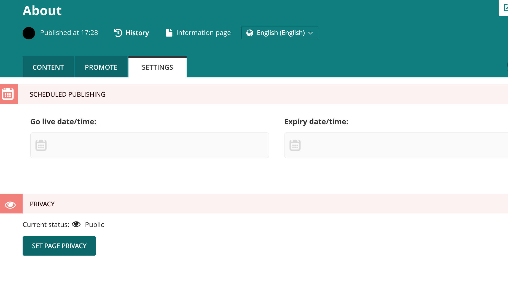

# Managing page privacy

Both directories (Logbooks, Stories, Radio Page and Contributors) and invidual pages can be set to private or public

## Directories

1. The current status of a directory will be displayed in the top right hand corner of the screen

2. Click on the Public button to edit
3. Select the required level of privacy and if requested enter a password or select the permitted user group/role
4. When a page is set as private follow the same steps in reverse
5. NB - setting a directory to public or private will apply to all pages within it (called child pages in the Wagtail system)

   

## Pages

1. To change the status of an individual page go to Settings and click Select Page Privacy. Follow step 3 above.

   
