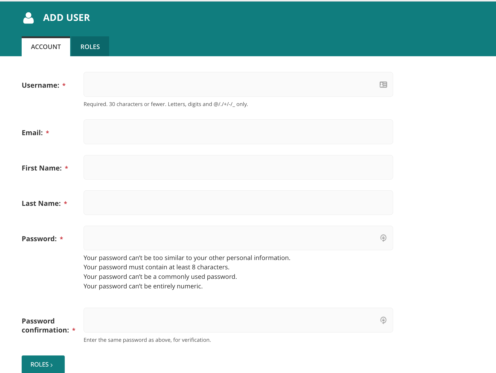
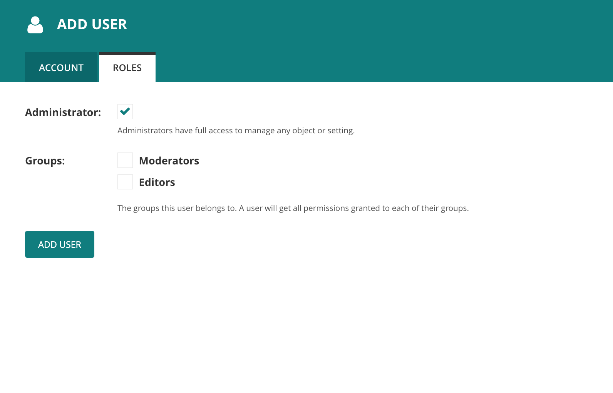
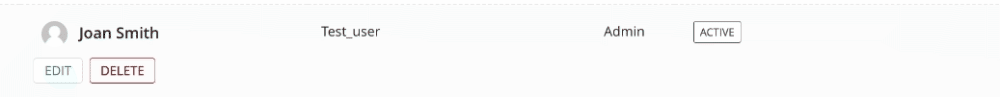
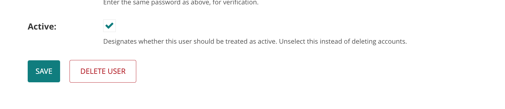
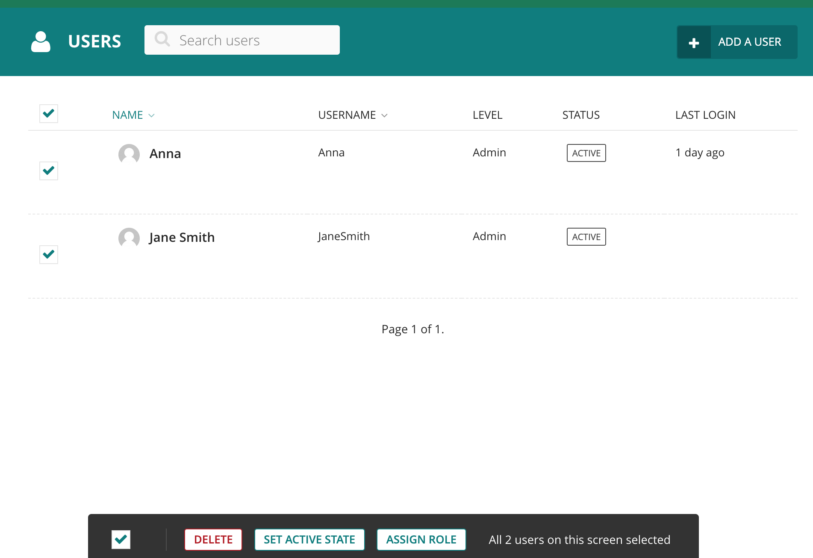

The Wagtail docs cover user management here

https://docs.wagtail.org/en/stable/editor_manual/administrator_tasks/managing_users.html

# Add a user

1. Log into the site and head to https://atlas.smartforests.net/admin/users/
2. Click on Add a User in the top right hand corner of the screen

   

3. Fill out the required fields in the Account tab

   

4. Click on the Roles tab and select the roles for this user

   

5. Click on Add User and you are done!

# Edit an existing user

1. Hover over a user and edit and delete buttons will appear
   

2. Click edit and amend account fields and roles as required

# Remove a user

1. To temporarily disable a user account you can uncheck the Active box when editing a user

   

2. To remove an account click the delete user button. This button can also be found in the user listings screen when hovering over a user.

# Bulk actions

1. Click on the checkbox at the top left of the users table
2. A bulk action menu will appear at the bottom of the screen

   
